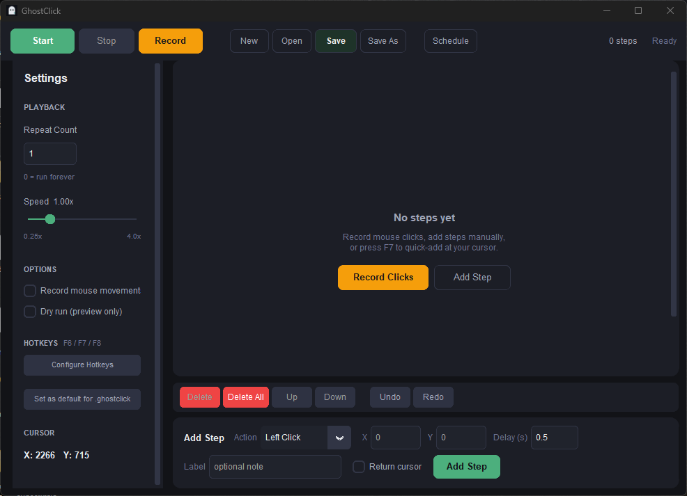

# GhostClick

A lightweight mouse automation tool for Windows. Record clicks, build scripts, play them back.

I built this because I needed something like [Auto Mouse Click](https://www.murgee.com/auto-mouse-click/) but without the bloat, ugly UI, or license fees. GhostClick does the same job — automate repetitive mouse actions — in a clean dark interface that doesn't look like it fell out of 2005.

  



## What it does

- **Record** mouse clicks in real time (left, right, double-click) and replay them
- **Build scripts manually** by entering coordinates, click types, and delays
- **Mouse movements** — not just clicks, you can script cursor moves too
- **Configurable hotkeys** — F6 to capture cursor position, F7 to quick-add a step, F8 to start/stop playback (all rebindable)
- **Speed control** — slow scripts down to 0.25x or speed them up to 4x
- **Repeat** a set number of times or loop forever, with optional delay between loops
- **Schedule** scripts to run at a specific time
- **Undo/redo** for every edit
- **Live cursor position** displayed in the sidebar so you always know your coordinates
- **Dry run mode** to preview without actually clicking anything
- Saves scripts as `.ghostclick` JSON files — easy to share, version, or edit by hand

## Getting started

### Run from source

```
pip install -r requirements.txt
python main.py
```

Optionally pass a script file to open it directly:

```
python main.py myscript.ghostclick
```

### Build a standalone exe

```
pip install -r requirements.txt
python -m PyInstaller build.spec --noconfirm
```

The exe lands in `dist/GhostClick.exe`. Single file, no installer needed.

## How to use it

**Recording:** Hit the Record button (or just start clicking around after pressing Record). When you stop, all your clicks get added as steps. The recorder picks up double-clicks automatically.

**Manual entry:** Use the form at the bottom to add steps one at a time. Pick the action type, enter coordinates, set a delay, and hit Add Step. Press F6 (default) anywhere on screen to grab the cursor position into the X/Y fields.

**Quick-add:** Press F7 (default) to instantly add a left-click step at wherever your cursor is. Handy for building scripts fast without touching the UI.

**Playback:** Hit Start. The script runs through each step in order, waiting the specified delay before each action. Press F8 or the Stop button to interrupt. Set a repeat count in the sidebar, or use 0 to loop until you stop it. You can also set a repeat delay to pause between loops.

**Scheduling:** Click the Schedule button in the toolbar to run a script at a future time.

## File format

Scripts are plain JSON with a `.ghostclick` extension:

```json
{
  "version": "1.0",
  "name": "My Script",
  "repeat_count": 3,
  "steps": [
    {
      "x": 500,
      "y": 300,
      "click_type": "left",
      "delay_before": 0.5,
      "return_cursor": false,
      "label": ""
    }
  ]
}
```

`click_type` can be `left`, `right`, `double`, or `move`. The `return_cursor` flag moves the mouse back to its original position after the action. `label` is an optional note for your own reference.

## Project structure

```
core/
  script.py      # ClickEntry data model, Script with undo/redo
  player.py      # Threaded playback engine (pyautogui)
  recorder.py    # Live mouse recording (pynput)
  scheduler.py   # Time-based scheduling (APScheduler)
ui/
  app_window.py  # Main window, toolbar, input form
  click_list.py  # Scrollable step list
  settings_panel.py  # Sidebar with playback/hotkey/options settings
  theme.py       # Color palette and font definitions
utils/
  file_io.py     # JSON save/load, Windows file association
```

## Requirements

- Python 3.11+
- Windows (uses pyautogui and keyboard, which need Windows APIs for global hotkeys)
- Dependencies: customtkinter, pynput, pyautogui, keyboard, apscheduler
